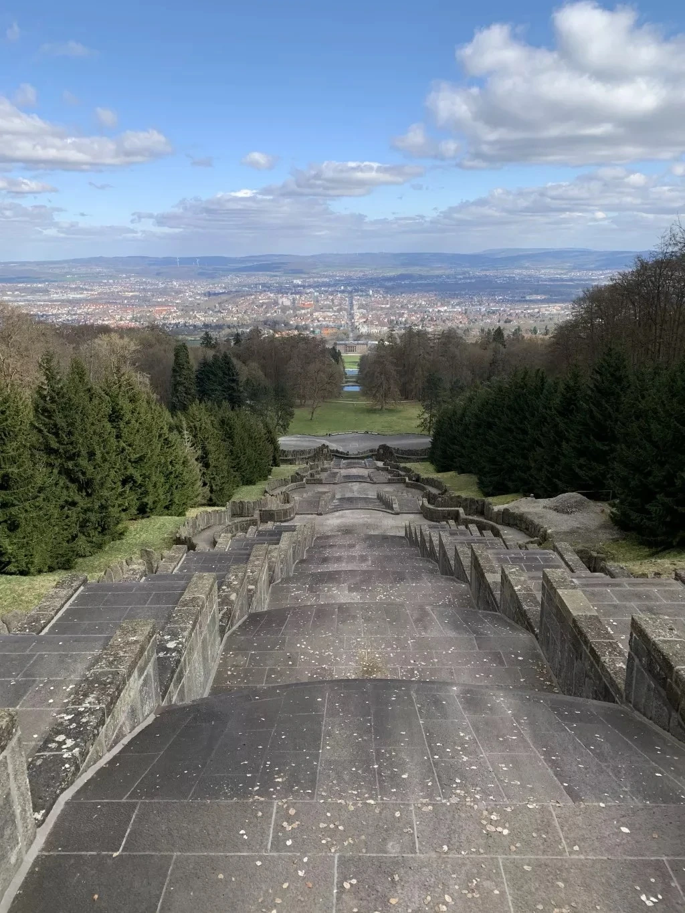
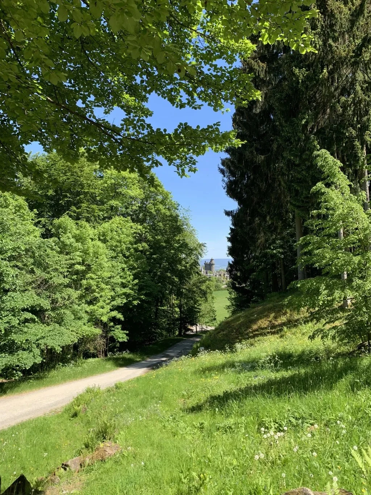
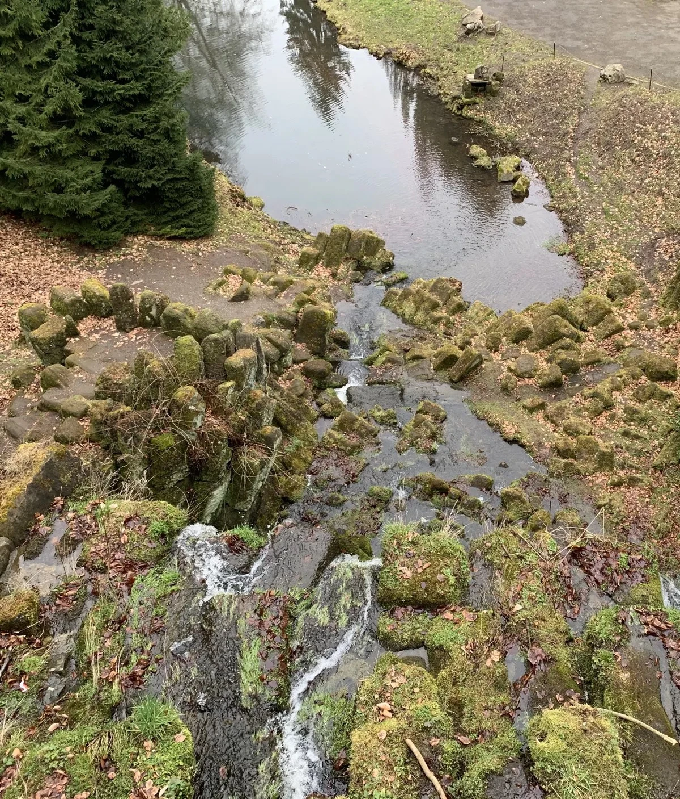
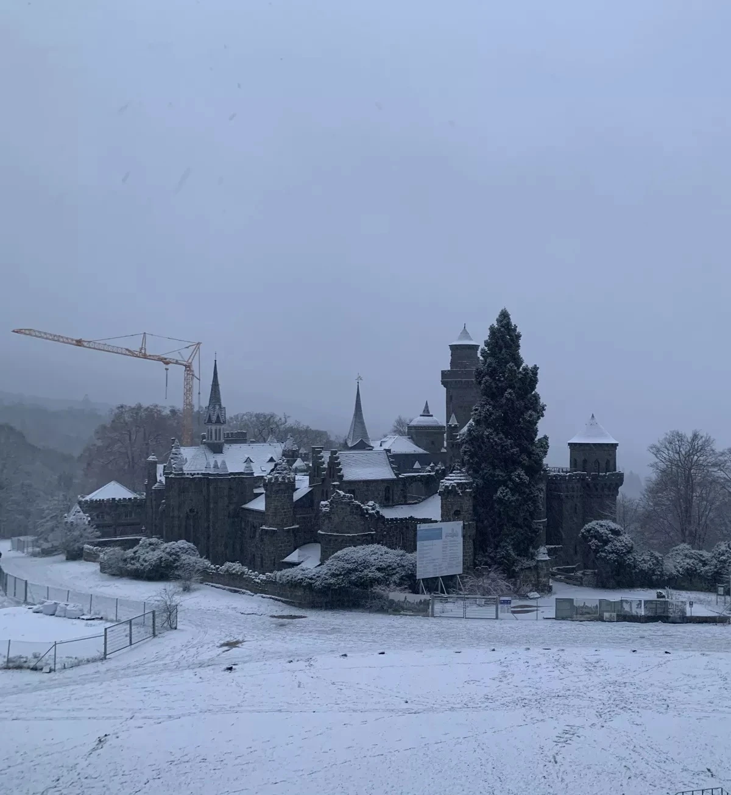

+++
title = 'Vier Jahreszeiten im Kasseler Bergpark'
image = '01_ich_und_herkules.webp'
date = 2022-01-02
lastmod = 2022-01-02
draft = false
tags = ['deutsch']
+++

Seit nun über einem Jahr leben wir mit dem Kasseler Bergpark direkt nebenan. In diesem Beitrag möchte ich gerne die Impressionen und Sehenswürdigkeiten, die sich im Lauf der Jahreszeiten bieten, teilen.

Das im Artikel beschriebene Gebiet bezieht sich auf ein größeres Areal im äußeren Westen Kassels, welches sich, auch wenn man alle Highlights sehen möchte, gut in einem oder zwei Tagesausflügen fußläufig erkunden lässt. Eine Übersicht über das Gebiet lässt sich hier finden: Link zu OpenStreetMap.

Der Wikipedia Artikel zum Bergpark Wilhelmshöhe liefert Interessierten viele weitere Details, zu dem seit 2013 als UNESCO Welterbe definierten Areal. Hier möchte ich aber mehr auf die persönlichen und subjektiven Eindrücke, als auf objektive Fakten eingehen.

## Einmal alles neu im Frühling
Wenn Mutter Natur langsam wieder aus dem Winterschlaf erwacht, wird auch das Treiben im Bergpark wieder lauter. An jeder Ecke sieht man das Grün sprießen und die Tiere aus ihren Verstecken hervorkommen. Auch die Menschen scheinen frische Energie getankt zu haben und Ihre guten Vorsätze für das Neue Jahr sind wohl auch noch nicht ganz beiseite gelegt. Man sieht es an Ihren Gesichtsausdrücken, wenn sie einem beim Spaziergang den Weg kreuzen. Das Bild zum Abschnitt ist auch gleich eine der häufigst gemachten Aufnahmen im Bergpark: der Blick vom Herkules herunter auf die Stadt. Die Stufen sind wohl auch der Ort im Park, an dem man den anderen Besuchern gezwungenermaßen am nächsten kommt. Wer das oder generell Treppen nicht mag, kann diese beim Abstieg auch meiden, in dem er den Seitenpfad von oben aus rechts gesehen wählt.

## Sommer, Sonne, Sonnenschein
Warme Temperaturen, lebendige Gerüche und reges Treiben sorgen auch im Bergpark für gute Laune. Zu dieser Jahreszeit sieht man auch die meisten Touristen hier, welche aus aller Welt herbeiströmen. So erkennt man beim Lauschen deren Unterhaltungen vornehmlich französisch, spanisch, englisch, türkisch und viele der deutschen Dialekte. Im frühen Sommer lohnt es sich besonders eine Picknickdecke mitzubringen, da die Gräser auf den vielen Wiesen noch nicht so hoch sind und der Schäfer seine Schafe noch nicht regelmäßig durch den Park führt. Ein ruhiges Plätzchen ohne Passanten findet sich dann recht schnell. Das mit den Schafen hat insofern mit der Gastlichkeit der Wiesen zu tun, als dass die Tiere neben interessanten Gerüchen auch diverse Ausscheidungen hinerlassen. Das viele der Wiesen nicht gemäht werden, dient natürlich dem Naturschutz. Vor dem Schloß liegt aber eine sehr große und zentrale Grasfläche, die den ganzen Sommer über zum Sonnen und Liegen einlädt. Dort ist es dann aber natürlich nicht ganz so still und es ist dementsprechend schwerer der Natur zuzuhören. Das Bild ist auf dem Weg vom Schloß, links vorbei am Steinhöfer Wasserfall, auf dem Weg zur Löwenburg entstanden.

## Melancholischer Herbstblues

Wenn die Tage wieder kürzer werden, sind die meisten Parkbesucher entweder einheimische oder Menschen aus der näheren Umgebung. Zu dieser Jahreszeit erinnern mich viele Teile des Bergparks an ein irisches Landschaftsbild. So z.B. auch der auf dem Bild zu sehende Wasserverlauf, wo eigentlich nur noch ein paar Kobolde fehlen. Auch im späteren Herbst verschwindet das Grün des Parks nie vollständig. Entsprechende Kleidung vorausgesetzt, kann einem ein Besuch einer der Wasserfälle, gerade bei Regen, die Natur und ein ganz besonderes Gefühl der Verbundenheit näher gebracht werden. Die im deutschen Herbst üblichen Farbenspiele gibt es natürlich trotzdem, besonders in den Bereichen in denen viele Laubbäume stehen (wo auch sonst).

## Im Winterschlaf

Wenn man sich trotz Lethargie und Müdigkeit zu einem Spaziergang im Park aufraffen kann, wird man dafür stets belohnt. Es ist interessant zu sehen, dass eben doch nicht alle Tiere in wärmere Regionen gezogen sind und auch die Pflanzenwelt nicht völlig ruht. Aufgrund der höheren Lagen im Vergleich zum Rest Kassels, stehen die Chancen auf Schnee bei entsprechenden Temperaturen nicht schlecht. Einmal ins Winterkleid eingehüllt erscheinen uns die vorher noch so anders bekannten Szenenbilder auf einmal so als seien sie aus einer finsteren mittelalterlichen TV-Serie wie “Game of Thrones” entnommen. Die Baukräne, zuerst am Herkules und später an der Löwenburg, muss man sich dafür natürlich weg denken.

## Fazit

Ich hoffe ich konnte evtl. einige noch unbekannte Aspekte unseres schönen Berkparks aufzeigen und werde diesen Beitrag in Zukunft noch um eine Bilderserie ergänzen. Zum Schluss noch die Bitte um einen kleinen Gefallen: Wer sich zufällig vor Ort wiederfindet, der möge doch bitte kurz Laut “Max” und/oder “Sarina” rufen. Im Falle einer Antwort, bitte ich um eine kurze, sowie persönliche Nachricht an mich.