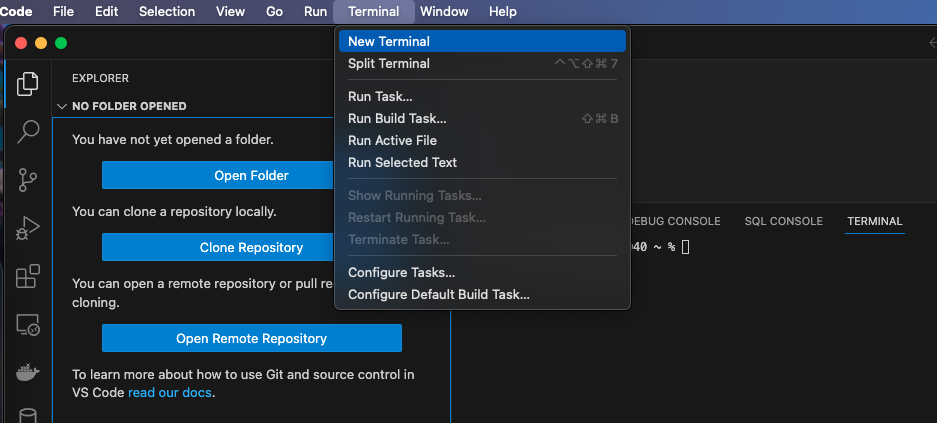
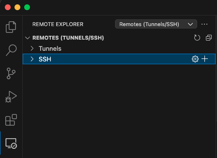
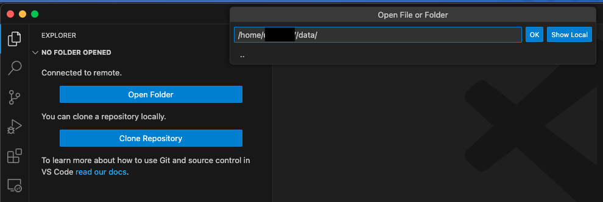
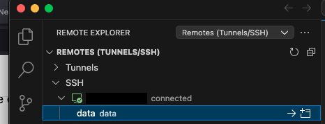

+++
title = 'Passwordless SSH Login to a Remote Server with Visual Studio Code'
image = '01_sshloginvscode.jpg'
date = 2024-02-08
lastmod = 2024-02-08
draft = false
tags = ['english']
+++

Following article describes how to enable You to login to a Remote Server with the industry standard 
SSH network protocol by using a key and Visual Studio Code, so you do not have to enter your user/password every 
time you want to connect. It was written for/on MacOS, but the procedure should be the same on Linux and similar for Windows.

## Preparation

At first <a href="https://code.visualstudio.com/" target="_blank">download</a>, install and open VS Code.


Then install the „Remote – SSH“ Extension by changing to the Extensions tab, searching for it and click on „Install“.

## Fun with Keys

At next open a terminal session by option „New Terminal“.



At the terminal prompt (normally shown at the bottom of your window) connect to your server 
by entering following line and pressing enter key.

```shell
ssh -p PORT USERNAME@SERVER
```

So for example your line could be like „ssh -p 22 heinz@mydomain.com“. 
Then accept/confirm any dialogues you are prompted to for confirmation as well es entering the password.

Now, just leave the ssh session by entering following command to the terminal:

```shell
exit 
```

At next you create a key for ssh (in case you do not already have one) on your local PC. 
Be sure you really exited/disconnected from the server before:

```shell
ssh-keygen
```

Once done, you can copy the public key part to the server by utilizing following command:

```shell
ssh-copy-id -p PORT USERNAME@SERVER
```

Next time if you login to the server with ssh you will not be asked for the password anymore 
but the key will be automatically verified in the background.

## Setting up the environment

So let’s try that by login at the server (ssh -p PORT USERNAME@SERVER) in the terminal again and by creating 
a workspace directory for the files you want to edit/control with VS code later on.

```shell
mkdir DIRECTORYNAME
```

The directory name can be anything you prefer, so e.g. „mkdir data“ could be suitable. 
Jump into this directory by sending command:

```shell
cd DIRECTORYNAME
```

e.g. „cd data“. Then print the full directory path to the terminal screen by:

```shell
pwd
```

The result will be something like „/home/heinz/data“. 
Copy this path to your clipboard or note/remember it. You are more then 50% done, now.

## Configure VS Code

Open the Remote SSH tab in VS Code and click on „+“ at SSH in the Remote Explorer.



Enter the same command you used before to connect to your server at the new prompt shown on top of the window:

```shell
ssh -p PORT USERNAME@SERVER
```


Choose the local ssh config file to update, normally the first proposal is fine.


Now, in the Remote Explorer you should see the new option for connection, like:


If it’s not directly shown, just click the refresh button as shown on top right of the screenshot. 
Then click on the „->“ arrow to connect.

Finally, switch to the File Explorer Tab and click on „Open Folder“. 
At the prompt you enter or select the directory you remembered or copied before and click on „OK“:



In case you are asked if you trust the authors of the directory it makes sense to choose yes, since you are the author 🙂

We are done. You most likely see an empty folder structure since we just created the folder and you can 
create new files of any kind, like the „README.MD“ on the next screenshot, and folders as you wish.


It’s also possible to copy files from your PC to the server by drag-and-drop as well as downloading 
files/folders by a right-click on it at the VS Code File Explorer.

## Result

Next time you open VS Code the connection will be established automatically. 
In case you switch between different environments you can always go back to the Remote Explorer 
tab of VS Code and connect to the server. Be sure to select the folder for connection and not the server itself, 
otherwise you will be prompted to select a folder at the File Explorer Tab again.



I hope that short tutorial helped you out a bit 🙂

