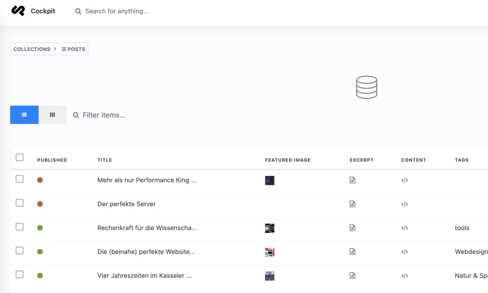
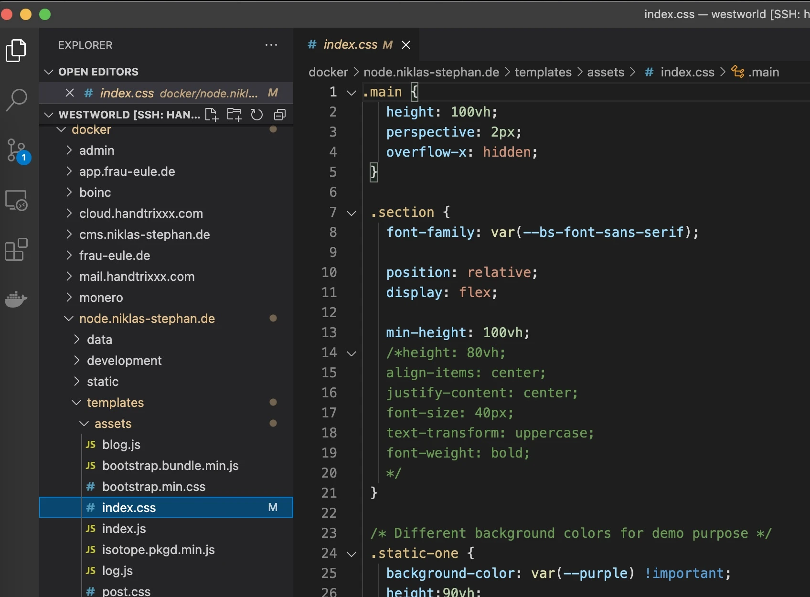

+++
title = 'Headless CMS, APIs und IoT für die Website'
image = 'webshot-scaled-1.webp'
date = 2022-10-02
lastmod = 2022-10-02
draft = false
tags = ['deutsch']
+++

Wie im Artikel “Die (beinahe) perfekte Website – Teil 1: Anforderungen” bereits angerissen, kommen bei Gestaltung und Umsetzung eines modernen Internetauftritts eine Vielzahl von Faktoren zusammen. Für alle denen eine einfache WordPress Installation nicht reicht, oder für die die möglichen Alternativen kennen lernen möchten, stelle ich in diesem Post meine Umsetzung mit Hilfe der Tools Cockpit, Node-RED und weiteren Helferlein vor.

## Was ist das Ziel?

Ich wollte erreichen dass meine Seite(n) beim Besucher weit unterhalb von 2 Sekunden geladen werden und dort hübsch und zeitgemäß dargestellt werden. Außerdem wollte ich dazu moderne Techniken und Tools verwenden. Soviel vorab: das Meiste davon ist mir gelungen :-). Bei der Auswahl der Tools habe ich größtenteils mir vertraute Lösungen genommen, mit dem headless CMS Cockpit aber auch etwas Neues ausprobiert. Aber der Reihe nach.

Es ist beinahe lustig dass das 2022 (wieder) der Fall ist, aber Microsoft Visual Studio Code(VS Code) ist tatsächlich beinahe das Wichtigste dieser Werkzeuge. Back to the Roots und ein klares Nein an die Generatoren von chaotischem und langsamem Quellcode wie WordPress, Jimdo usw. es nun mal sind. Außerdem ist VS Code weit mehr als nur ein erweiterter Text-Editor, sondern auch Open Source Tool zur Administration ganzer Containerlandschaften und natürlich vorzüglich zum Debugging. Vor einer Weile hatte ich dazu auch folgendes Anwendungsbeispiel geschrieben: Quellcode auf GitHub verwalten mit Visual Studio Code .

Seit Veröffentlichung von Version 5 des Open Source Frontend Toolkits Bootstrap von Twitter, ist dieses schneller den je zuvor. Man hat sich endlich des unnötigen Overheads des jQuery Frameworks entledigt und setzt nun vollständig auf natives “Vanilla” Javascript. Das gleiche habe ich bei den wenigen selbst geschriebenen Funktionen im Frontend natürlich auch gemacht. Bootstrap selbst stellt CSS Klassen, Icons, Komponenten und vieles mehr zur Verfügung, die bei der Entwicklung von UI/UX unwahrscheinlich viel Zeit und Aufwand sparen.



Mit den Open Source Web Content Management System (WCMS) Cockpit von Agentejo, gelingt die saubere Trennung von Back- und Frontend. Neben den für ein CMS üblichen Funktionalitäten zur Pflege- und Verwaltung von Web-Content und einer Medienverwaltung macht die integrierte API den Unterschied. Dazu später etwas mehr.

Das ursprünglich von IBM initiierte Open Source Projekt Node-RED ist vielleicht die zur Zeit beste Implementierung einer Internet of Things (IoT) Low-Code Platform. Sowohl die Einschränkung “Low-Code” als auch auf IoT, werden dem Tool aber nicht ganz gerecht. Zwar ist es mal für diese Szenarien entwickelt worden, lässt sich aber ohne Mühen auch für ganz viel Code und zur Abbildung aller möglichen vorstellbaren Prozesse nutzen. Ein Beispiel folgt.

Einige weitere benötigte Werkzeuge und Helfer wir den Nginx Reverse Proxy Manager, Let’s Encrypt SSL Zetifikate, Matomo Analytics, Docker(-Compose) und weitere würden hier vom Fokus ablenken, weshalb ich sie erstmal außen vor lasse.

## Warum?

Die Frage zum warum ist einfach zu beantworten; vor allem beruflich setze ich mich täglich mit den Hürden und Schwierigkeiten beim Umgang mit monolithischen Systemen auseinander. Andererseits propagieren Unternehmen wie die SAP neue Headless Ansätze. Das und meine innere Neugier haben mich angetrieben, einfach für mich selbst solch ein Setup vorzunehmen um evtl. neue Risiken, aber vor allem Möglichkeiten kennen zu lernen. Oder in kurz: Weil ich es können will und es gar nicht so schwierig ist.



## Wie genau?
Die Installation von Cockpit CMS und Node-RED in eigenständigen Containern geht schnell von der Hand und sollte in maximal 20 Minuten erledigt sein. Im Appendix, als Hilfestellung, meine Docker-Compose Dateien.

Jetzt geht es ans “Eingemachte”. Nach dem Entwurf des Layouts und der Umsetzung des Prototypen mit Bootstrap, lagere ich sämtlichen statischen HTML Content nach Cockpit CMS in Form von dort sogenannten “Singletons” aus. Die haben den Vorteil, dass sie mit Attributen wie Sprache und Version, etc. versehen werden können. Theoretisch könnte man das auch mit den CSS und Javascript Dateien machen, aber die bearbeite ich dann doch irgendwie lieber in Visual Studio Code. Als nächstes erstellen wir nun eine sogenannte “Collection” in Cockpit, die sozusagen den Rahmen um unsere Posts bildet. So ließe sich z.B. mit einer Cockpit Installation der Content für viele Websites verwalten. Klasse! Bilder, Grafiken und der Gleichen lassen sich auch mit Cockpit komfortabel verwalten und vor allem von dort aus auch automatisch als Thumbnails umwandeln. Noch besser! Der Zugriff auf das Ganze erfolgt dann über Web APIs, auf die ich gleich weiter eingehe. Und noch etwas; über sogenannte Webhooks lassen sich auch genau andersherum von Cockpit aus Aktionen starten. So starte ich z.B. bei jedem speichern/ändern der Collection automatisch ein Deployment der kompletten Website. Wow! Eigentlich war Cockpit einfach nur mein erster Google Treffer bei der Suche nach einem Headless CMS, aber mir fällt gerade kein Grund mehr ein warum ich wechseln bzw. mir andere ansehen sollte.

Und nun kommt Node-RED ins spiel, denn ich muss meine Inhalte ja nun irgendwie unter unter niklas-stephan.de verfügbar machen. Eigentlich geht es mir darum, mit dem Ziel maximaler Performanz, statische Seiten zu generieren. Bei einer Google Suche nach “Static Site Generators” ist Node-RED garantiert nicht auf der ersten Seite der Suchergebnisse zu finden. Dafür gibt es unzählige andere Tools, die aber auch wieder eine Einarbeitung und meistens auch das Erlernen einer eigenen Syntax erfordern. Durch meine umtriebigen Aktivitäten im Umfeld der Heimautomatisierung, ist mir aber nun Node-RED bestens vertraut und eigentlich will ich doch nur einen relativ einfachen Prozess abbilden. Und der sieht wie folgt aus:

1. Start des Deplyoments manuell oder durch Webhook
2. Sammeln aller statischen Quellen
3. Sammeln aller vorhanden Singletons und Posts
4. Dynamische Generierung von Meta-Daten
5. Rendern der einzelnen Seiten
6. Speichern der Seiten auf Platte und im Arbeitsspeicher

Wer sich die Mühe machen möchte mal kurz im Console Log dieser Seite zu gucken sieht, dass ich bei jedem Deployment Zeitpunkt und Dauer protokollieren lasse. Da sehen wir dann auch dass der beschriebene Prozess insgesamt 0,099 Sekunden dauert. Und das auf einem Server der nebenbei u.a. noch Monero schürft und meine Cloud Umgebung bereit stellt. Also eigentlich schon recht fix, aber um noch “eins Drauf” zu setzen lege ich die erzeugten Dateien im letzten Schritt im “/dev/shm”, sprich dem Arbeitsspeicher des Servers ab, von wo aus sie der Reverse Proxy beim Zugriff zur Verfügung stellt. Da braucht’s vorerst kein CDN mehr und mein Ziel ist erreicht. 🙂

## Appendix

compose.yml für Cockpit CMS

```yaml
services:
  cms-db:
    image: 'mongo:latest'
    restart: always
    volumes:
    - './db:/data/db'
    networks:
    - default
    logging:
      options:
        max-size: "10m"
        max-file: "3"
  cms:
    image: agentejo/cockpit
    restart: always
    volumes:
      - './cms/config.php:/var/www/html/config/config.php'
      - './cms/defines.php:/var/www/html/config/defines.php'
      - './storage:/var/www/html/storage'
    environment:
        COCKPIT_SESSION_NAME: SESSION
        COCKPIT_SALT: SALT
        COCKPIT_DATABASE_SERVER: 'mongodb://cms-db:27017'
        COCKPIT_DATABASE_NAME: DBNAME
    depends_on:
    - cms-db
    ports:
    - "8080:80"
    networks:
    - default
    logging:
      options:
        max-size: "10m"
        max-file: "3"
volumes:
  mongo-vol: null
```

compose.yml für Node-RED

```yaml
services:
  node-red:
    image: nodered/node-red:latest
    restart: always
    environment:
      - TZ=Europe/Berlin
    ports:
      - "1880:1880"
    networks:
      - default
    logging:
      options:
        max-size: "10m"
        max-file: "3"
    volumes:
      - ./data:/data
      - ./templates:/templates
      - ./static:/static
      - /etc/localtime:/etc/localtime:ro
      - /dev/shm/nsde:/ramdisk
      - ./development:/development
```
