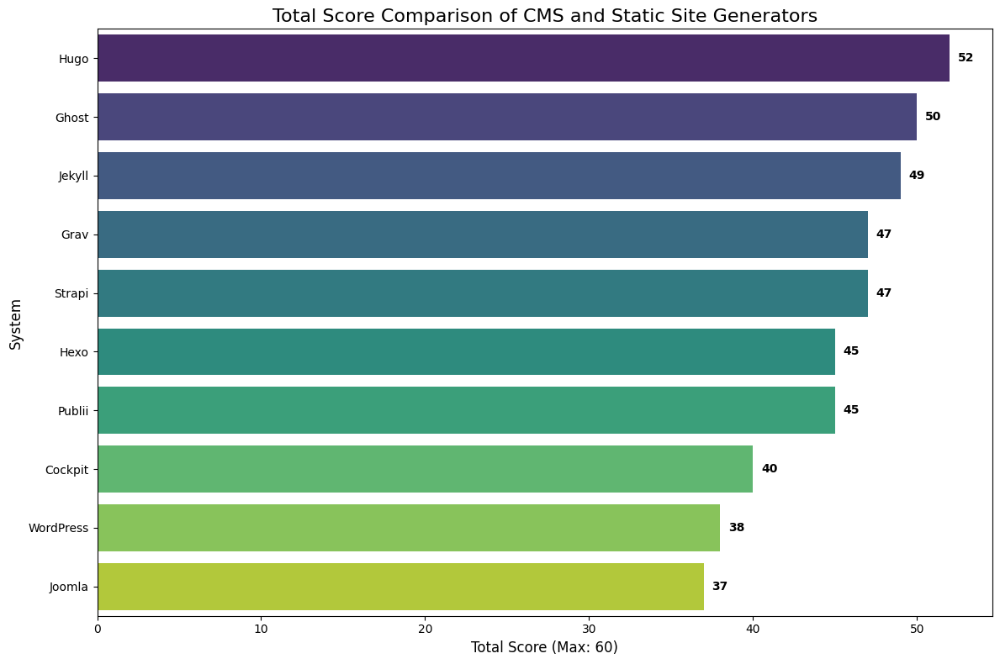

+++
title = 'Herr Doktor, ich habe Wordpress, kann man da noch etwas machen?'
slug = 'perfect-website-2025'
date = 2025-04-22
lastmod = 2025-04-22
draft = false
image = 'logo.webp'
tags = ['deutsch']
+++

*Ein umfassender Vergleich moderner CMS und Static Site Generators für 2025, erstellt von Niklas Stephan und seinem KI-Assistenten*

## Die Kurzfassung: Das Ranking der besten CMS und Static Site Generators

Nach umfassender Analyse von 12 Kriterien haben wir klare Gewinner identifiziert:

1. **Hugo (52 Punkte)** - Der Performance-Champion
2. **Ghost (50 Punkte)** - Die ausgewogene Alternative
3. **Jekyll (49 Punkte)** - Der Sicherheits-Experte

*WordPress landet mit nur 38 Punkten auf Platz 9 - warum? Das erfahren Sie in unserer Detailanalyse.*

## Die Vergleichstabelle im Detail


| Kriterium           | Hexo      | Grav      | Strapi    | Cockpit   | Ghost     | Publii    | WordPress | Hugo      | Jekyll    | Joomla    |
|---------------------|-----------|-----------|-----------|-----------|-----------|-----------|-----------|-----------|-----------|-----------|
| Typ(en)             | ★★★★☆     | ★★★★☆     | ★★★☆☆     | ★★★☆☆     | ★★★★☆     | ★★★★☆     | ★★★★★     | ★★★★☆     | ★★★★☆     | ★★★★★     |
| Backend             | ★☆☆☆☆     | ★★★★☆     | ★★★★★     | ★★★★☆     | ★★★★☆     | ★★☆☆☆     | ★★★★★     | ★☆☆☆☆     | ★☆☆☆☆     | ★★★★★     |
| Frontend            | ★★★★☆     | ★★★☆☆     | ★★★☆☆     | ★★★☆☆     | ★★★★☆     | ★★★★☆     | ★★★☆☆     | ★★★★☆     | ★★★★☆     | ★★★☆☆     |
| Dateibasiert        | ★★★★★     | ★★★★★     | ★☆☆☆☆     | ★★☆☆☆     | ★★★☆☆     | ★★★★★     | ★☆☆☆☆     | ★★★★★     | ★★★★★     | ★☆☆☆☆     |
| Docker ready        | ★★★☆☆     | ★★★☆☆     | ★★★★★     | ★★★★☆     | ★★★★☆     | ★★★☆☆     | ★★★★☆     | ★★★★☆     | ★★★☆☆     | ★★★★☆     |
| Popularität         | ★★★☆☆     | ★★★☆☆     | ★★★★☆     | ★★☆☆☆     | ★★★★☆     | ★★☆☆☆     | ★★★★★     | ★★★★☆     | ★★★★☆     | ★★★★☆     |
| Open Source         | ★★★★★     | ★★★★★     | ★★★★★     | ★★★★★     | ★★★★★     | ★★★★★     | ★★★★★     | ★★★★★     | ★★★★★     | ★★★★★     |
| Moderne Codebase    | ★★★★☆     | ★★★★☆     | ★★★★★     | ★★★★☆     | ★★★★★     | ★★★★☆     | ★★☆☆☆     | ★★★★★     | ★★★★☆     | ★★☆☆☆     |
| Aktueller Code      | ★★★★☆     | ★★★★☆     | ★★★★★     | ★★★★☆     | ★★★★★     | ★★★★☆     | ★★★★☆     | ★★★★★     | ★★★★☆     | ★★★★☆     |
| Security            | ★★★★☆     | ★★★★☆     | ★★★★☆     | ★★★☆☆     | ★★★★☆     | ★★★★☆     | ★☆☆☆☆     | ★★★★★     | ★★★★★     | ★☆☆☆☆     |
| Performance         | ★★★★☆     | ★★★★☆     | ★★★☆☆     | ★★★☆☆     | ★★★★☆     | ★★★★☆     | ★★☆☆☆     | ★★★★★     | ★★★★★     | ★★☆☆☆     |
| Clean Frontend      | ★★★★☆     | ★★★★☆     | ★★★★☆     | ★★★☆☆     | ★★★★☆     | ★★★★☆     | ★☆☆☆☆     | ★★★★★     | ★★★★★     | ★☆☆☆☆     | 


## Was bedeuten die Bewertungskriterien?

- **Typ(en)**: Vielseitigkeit des Systems (SSG, Headless CMS, klassisches CMS)
- **Backend**: Qualität des Admin-Panels, API und Benutzerverwaltung
- **Frontend**: Flexibilität bei Themes, Templates und API-Ausgabe
- **Dateibasiert**: Arbeitet mit Dateien statt Datenbank (Markdown, Flat-File)
- **Docker ready**: Einfachheit der Container-Bereitstellung
- **Popularität**: Größe der Community und Verbreitung
- **Open Source**: Vollständige Quelloffenheit
- **Moderne Codebase**: Einsatz aktueller Technologien und Best Practices
- **Aktueller Code**: Aktivität der Entwicklung und Updates
- **Security**: Sicherheit gegen Angriffe und Exploits
- **Performance**: Ladegeschwindigkeit und Ressourceneffizienz
- **Clean Frontend**: Qualität des generierten HTML/CSS/JS-Codes

## Die drei Systemkategorien im Vergleich

### Static Site Generators: Die Performance-Champions

**Vorteile:**
- Herausragende Sicherheit (keine Datenbank = weniger Angriffsfläche)
- Blitzschnelle Ladezeiten durch statische Dateien
- Sauberer, schlanker Code ohne Bloat
- Kostengünstigeres Hosting möglich

**Top-Empfehlungen:**
- **[Hugo](https://gohugo.io)** (52 Punkte): Blitzschnell, sicher, mit sauberem Code-Output
- **[Jekyll](https://jekyllrb.com)** (49 Punkte): Der Klassiker mit hervorragender Sicherheit
- **[Hexo](https://hexo.io)** (45 Punkte): Flexibler Generator mit Node.js-Basis

**Nachteile:** Schwächeres Backend, erfordert mehr technisches Know-how

### Moderne CMS: Die ausgewogene Mitte

**Vorteile:**
- Balance zwischen Benutzerfreundlichkeit und technischer Qualität
- Moderne Codebasis mit aktuellen Technologien
- Bessere Sicherheit als traditionelle CMS

**Top-Empfehlungen:**
- **[Ghost](https://ghost.org)** (50 Punkte): Perfekt ausbalanciert, ohne signifikante Schwächen
- **[Strapi](https://strapi.io)** (47 Punkte): Führendes Headless-CMS mit exzellentem Backend
- **[Grav](https://getgrav.org)** (47 Punkte): Dateibasiertes CMS mit modernem Ansatz

**Nachteile:** Teilweise geringere Verbreitung und kleineres Plugin-Ökosystem

### Traditionelle CMS: Die Popularitäts-Riesen

**Vorteile:**
- Riesiges Ökosystem an Plugins und Themes
- Umfangreiche Community und Support
- Einfacher Einstieg für Anfänger

**Vertreter:**
- **[WordPress](https://wordpress.org)** (38 Punkte): Marktführer mit großem Ökosystem
- **[Joomla](https://www.joomla.org)** (37 Punkte): Alternative mit ähnlichen Eigenschaften

**Nachteile:** Erhebliche Sicherheitsprobleme, schlechte Performance, unsauberer Code

## Die Stärken und Schwächen der Top-Systeme

### Hugo: Der technische Spitzenreiter

**Stärken:**
- Blitzschnelle Generierung (bis zu 100x schneller als andere SSGs)
- Hervorragende Sicherheit durch statische Dateien
- Extrem sauberer Output-Code
- Keine Datenbank nötig

**Schwächen:**
- Minimalistisches Backend (1★)
- Steilere Lernkurve für Einsteiger

### Ghost: Die ausgewogene Alternative

**Stärken:**
- Modernes, intuitives Backend
- Hervorragende Editor-Erfahrung
- Gute Performance und Sicherheit
- Keine signifikanten Schwächen (mindestens 3★ in allen Kategorien)

**Schwächen:**
- Geringere Verbreitung als WordPress
- Weniger Themes und Plugins verfügbar

### WordPress: Der populäre Problemfall

**Stärken:**
- Größtes Ökosystem an Plugins und Themes
- Höchste Verbreitung und Community
- Einfacher Einstieg für Anfänger

**Schwächen:**
- Kritische Sicherheitsprobleme (1★)
- Schlechte Performance (2★)
- Unsauberer Frontend-Code (1★)
- Veraltete Codebasis (2★)

## Fazit: Zeit für einen Wechsel?

Die Analyse zeigt deutlich: **Moderne Alternativen bieten erhebliche technische Vorteile gegenüber WordPress und Joomla**. Besonders in den kritischen Bereichen Sicherheit, Performance und Code-Qualität fallen die traditionellen CMS deutlich ab.

**Unsere Empfehlungen:**

- **Für neue Projekte**: Setzen Sie auf Hugo, Jekyll oder Ghost
- **Für bestehende WordPress-Seiten**: Erwägen Sie eine Migration zu Ghost oder Grav
- **Für komplexe Anwendungen mit API-Bedarf**: Strapi bietet ein hervorragendes Backend

Die Entscheidung sollte letztlich von Ihren spezifischen Anforderungen abhängen - aber eines ist klar: Es gibt heute bessere Alternativen als WordPress. Ich selbst habe https://niklas-stephan.de inzwischen auf Hugo migriert und werde dazu eventuell in einem separaten Beitrag detailliert berichten.

*Haben Sie Fragen oder Anmkerungen zur Migration von WordPress zu einer modernen Alternative? Nutzen Sie die Kommentarfunktion um Ihre Gedanken mit uns zu teilen.*