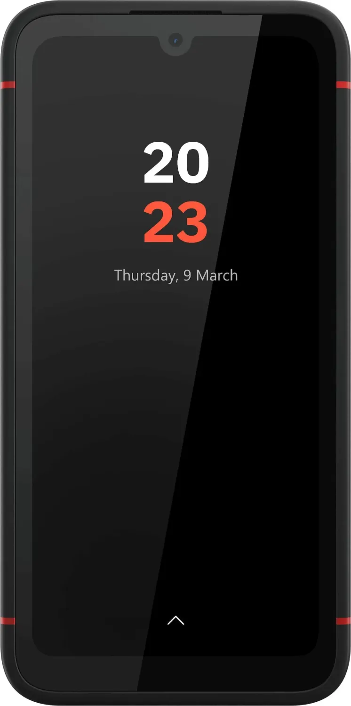
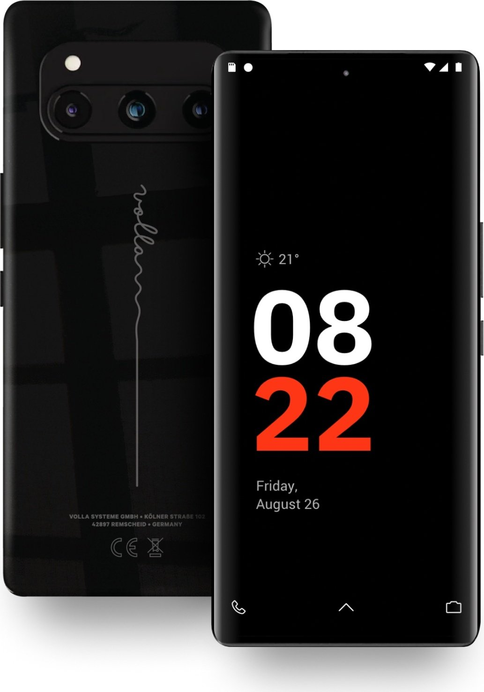
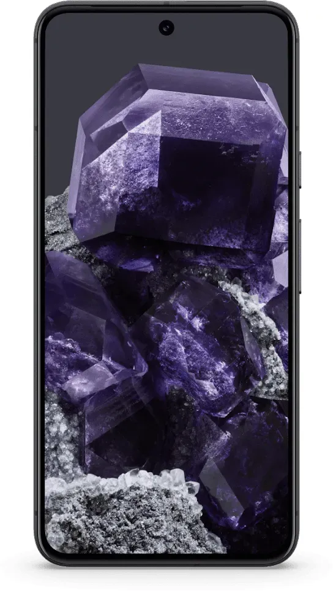
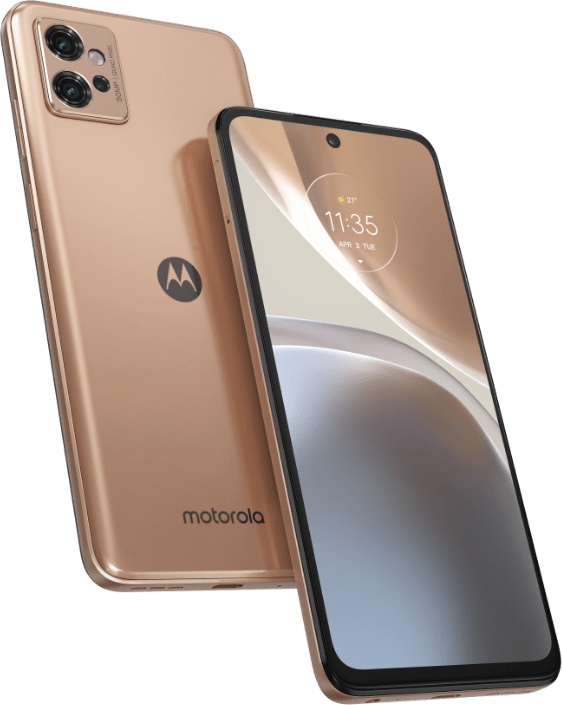
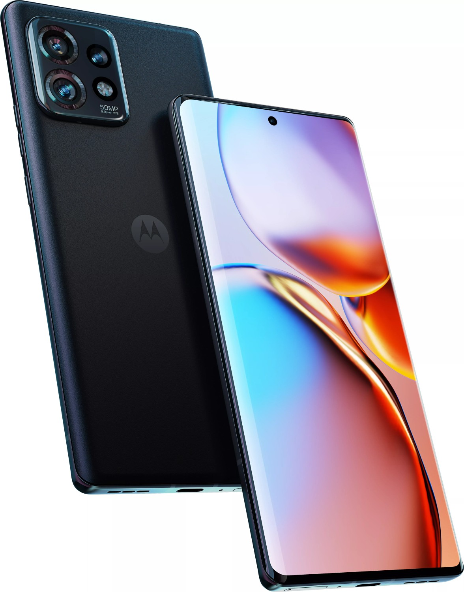
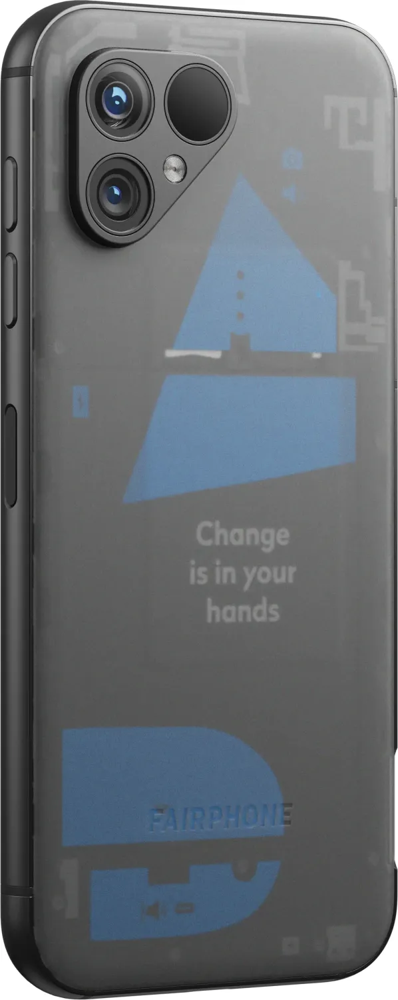
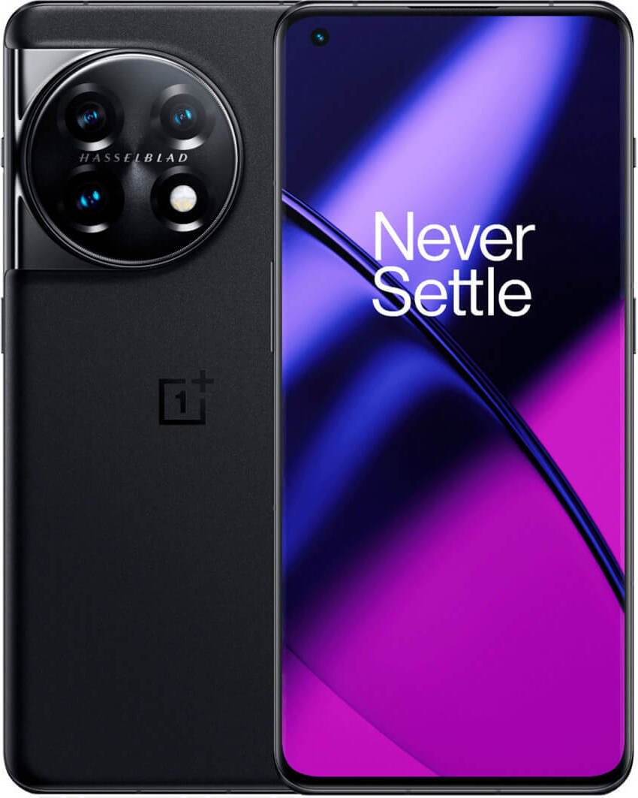

+++
title = 'Das datenschutzfreundlichste Mobiltelefon 2025'
slug = 'oss-mobiles-2025'
image = 'mobile2025_web.webp'
date = 2025-05-01
lastmod = 2025-05-01
draft = false
tags = ['deutsch']
summary = 'Ein Überblick über die nachhaltigsten und datenschutzfreundlichsten Mobiltelefone des Jahres 2025.'
+++

Ständig werden neue Handys auf den Markt geworfen und von unabhängigen Agenturen, Zeitschriften und Personen getestet. Der Fokus dieser Tests liegt jedoch meist auf der Hardwareleistung des Geräts. Beim Betriebssystem wird in 99 % der Fälle einfach hingenommen, dass auf dem Gerät sowohl von Google als auch vom Hardwarehersteller eventuell unerwünschte und vor allem datenhungrige Applikationen vorinstalliert werden. In vielen Fällen lassen sich diese dann nicht einmal deinstallieren.  
Deshalb konzentriert sich dieser unabhängige Test ganz auf den Aspekt des Datenschutzes und behandelt die anderen Kriterien nur beiläufig. Zuvor räumen wir aber noch mit falschen Vorstellungen über den Zusammenhang zwischen Open Source, Linux, Android und Google auf.

## Für ungeduldige Leser: Das Vergleichsergebnis

Sehr gerne! Hier ist eine übersichtliche Rangordnung der getesteten Handys, basierend auf den genannten Kriterien, sowie kurze Kommentare zu jedem Gerät. Die Reihenfolge orientiert sich an Datenschutz, Nachhaltigkeit, Preis-Leistung und Alltagstauglichkeit.

---

### 1. **Fairphone 5**
**Rang:** ★★★★★  
**Kommentar:**  
Das Fairphone 5 ist das nachhaltigste Gerät im Test. Es punktet mit modularer Bauweise, langer Ersatzteilverfügbarkeit und einem wechselbaren Akku. Die Hardware ist solide, die Kamera gut, und es gibt offiziellen Support für alternative Android-Versionen wie /e/OS und LineageOS. Wer Wert auf Datenschutz und Reparierbarkeit legt, findet hier die beste Option – auch wenn der Preis im oberen Bereich liegt.

---

### 2. **Volla Phone X23**
**Rang:** ★★★★☆  
**Kommentar:**  
Das Volla Phone X23 kommt ab Werk mit einem Google-freien Android (Volla OS) und bietet einen wechselbaren Akku sowie robuste Bauweise (IP68, MIL-STD-810H). Die Hardware ist solide, die Kamera gut, und der Preis ist fair. Für Datenschutz-Fans, die ein robustes und alltagstaugliches Gerät suchen, eine sehr gute Wahl.

---

### 3. **Google Pixel 8 Pro**
**Rang:** ★★★★☆  
**Kommentar:**  
Das Pixel 8 Pro bietet Top-Hardware, exzellente Kamera und lange Update-Garantie. Dank LineageOS-Support lässt sich ein Google-freies Android installieren, allerdings ist der Weg dahin nicht ganz trivial und der Akku ist nicht wechselbar. Wer Wert auf Kamera und Performance legt und bereit ist, das System umzubauen, bekommt hier ein sehr gutes Gesamtpaket.

---

### 4. **Google Pixel 9**
**Rang:** ★★★★☆  
**Kommentar:**  
Das Pixel 9 ist ähnlich stark wie das 8 Pro, etwas kompakter und günstiger. Auch hier gibt es lange Updates und LineageOS-Support. Die Kamera ist hervorragend, der Akku fest verbaut. Für alle, die ein aktuelles, leistungsstarkes Gerät mit Custom-ROM-Option suchen, eine sehr gute Wahl.

---

### 5. **Volla Quintus**
**Rang:** ★★★★☆  
**Kommentar:**  
Das Volla Quintus ist das Flaggschiff von Volla, kommt ebenfalls mit Google-freiem Android und sehr guter Hardware. Der Akku ist wechselbar, das Display groß und hell. Der Preis ist allerdings recht hoch, was das Preis-Leistungs-Verhältnis etwas schmälert.

---

### 6. **OnePlus 11**
**Rang:** ★★★★☆  
**Kommentar:**  
Das OnePlus 11 bietet Top-Hardware und ist für Custom-ROMs wie LineageOS geeignet. Der Akku ist allerdings nicht wechselbar und die Nachhaltigkeit ist nur durchschnittlich. Wer Wert auf Performance und ein gutes Preis-Leistungs-Verhältnis legt, findet hier ein starkes Gerät.

---

### 7. **Motorola Edge 40 Pro**
**Rang:** ★★★★☆  
**Kommentar:**  
Das Edge 40 Pro ist ein leistungsstarkes Gerät mit sehr guter Kamera und LineageOS-Support. Der Akku ist fest verbaut, die Reparierbarkeit eingeschränkt. Für Power-User, die ein Custom-ROM nutzen wollen, eine interessante Option.

---

### 8. **Motorola Moto G32**
**Rang:** ★★★☆☆  
**Kommentar:**  
Das Moto G32 ist das günstigste Gerät im Test und bietet solide Hardware für den Alltag. Es gibt LineageOS-Support, aber die Kamera und Performance sind nur durchschnittlich, und der Akku ist nicht wechselbar. Für Sparfüchse, die Wert auf Datenschutz legen, dennoch eine brauchbare Wahl.

---

## Open Source, Linux, Android und Google

Open Source bedeutet nicht automatisch Datenschutz oder Sicherheit. Viele Menschen setzen Open-Source-Software mit sicherer und datenschutzfreundlicher Software gleich, was jedoch nicht immer der Realität entspricht. Es ist wichtig, die Unterschiede und Zusammenhänge zwischen Open Source, Linux, Android und den Diensten von Google zu verstehen.

Open Source bedeutet zunächst einmal, dass der Quellcode einer Software öffentlich einsehbar ist. Dadurch können Entwickler und Experten den Code überprüfen, Schwachstellen identifizieren und zur Verbesserung beitragen.

Linux ist ein Open-Source-Betriebssystem, das als Grundlage für viele andere Systeme dient, einschließlich Android. Es bietet eine hohe Flexibilität und Anpassungsfähigkeit, jedoch hängen Datenschutz und Sicherheit stark von der jeweiligen Implementierung und den darauf aufbauenden Diensten ab. Da auch Android auf Linux basiert, erbt es zwar einige der Vorteile von Open Source, ist jedoch stark von den Entscheidungen und Diensten von Google geprägt, was den Datenschutz beeinflussen kann.

Das heißt: Ein Mobiltelefon, auf dem Android ohne Google-Dienste betrieben wird, kann als deutlich datenschutzfreundlicher betrachtet werden.

## Alternativen zu Android

Es gibt natürlich auch noch andere Optionen als Android, wie beispielsweise Apples iOS oder andere Linux-basierte Betriebssysteme.  
iOS ist jedoch proprietär (nicht Open Source) und stark in das Apple-Ökosystem eingebunden. Auf Apple-Mobiltelefonen ist es außerdem nicht möglich, alternative Betriebssysteme zu installieren.  
Deshalb stellen in diesem Test Apples Telefone keine Option dar.

Eine weitere Möglichkeit sind Linux-basierte Betriebssysteme wie /e/OS, LineageOS oder Ubuntu Touch, die ohne Google-Dienste auskommen und den Fokus auf Datenschutz legen.  
Hier muss man auch wieder unterscheiden, ob es sich beim Betriebssystem um ein von den Google-Diensten befreites Android handelt, wie das z. B. bei LineageOS der Fall ist, oder um eine eigenständige Distribution wie z. B. Ubuntu Touch.

Während sich auf den Android-Systemen grundsätzlich alle dafür entwickelten Anwendungen ausführen lassen und man ggf. nur auf einen nicht von Google betriebenen App-Store ausweichen muss, sieht die Sache bei einer eigenständigen Distribution anders aus.

Da sich aktuell kaum Entwickler an den Entwicklungen zu eigenständigen Distributionen beteiligen und diese auch nur ein winziges Zielpublikum bedienen, herrscht bei der Auswahl von Anwendungen größtenteils gähnende Leere. An dieser Situation wird sich auch mittelfristig nichts ändern, weshalb wir diese in unserem Test ebenfalls ignorieren werden.

## Testkriterien

Auf Basis der zuvor beschriebenen Ausgangslage bauen wir für unsere Bewertung folgende Kriterien auf:

1. Ein von Google befreites Android ist bereits installiert (5 Sterne) oder lässt sich ohne Funktionsverlust installieren (3 Sterne).
2. Die Hardware des Geräts ist zeitgemäß und bietet mindestens einen Quad-Core-Prozessor, 6 GB RAM sowie mindestens 64 GB Festspeicher.
3. Die Hardware ist nachhaltig, indem sich einzelne Komponenten im Falle eines Defekts austauschen lassen.
4. Die Kamera erlaubt es, Fotos in guter Qualität zu machen.
5. Der Akku hat eine hohe Kapazität.
6. Der Preis sollte 700 € nicht überschreiten.

---

## Die Testkandidaten

### Volla Phone X23 (Volla OS – Android)

[Preisvergleich bei Heise](https://preisvergleich.heise.de/volla-phone-x23-volla-os-schwarz-a2961652.html)  
[Herstellerseite](https://volla.online/de/volla-phone-x23/)

**Betriebssystem:** Volla OS  
**Display:** 6,1", 1560x720 Pixel, IPS, Gorilla Glass 5, 282 ppi  
**Kamera hinten:** 48 MP (Haupt), 8 MP (Weitwinkel)  
**Kamera vorne:** 16 MP  
**Schnittstellen:** USB-C 2.0, 3,5 mm Klinke, Wi-Fi 5, Bluetooth 5.2, NFC  
**Sensoren:** Beschleunigungssensor, Gyroskop, Annäherungssensor, Lichtsensor, Kompass, Barometer, Fingerabdrucksensor (seitlich)  
**SoC:** MediaTek Helio G99  
**CPU:** 8 Kerne (2x 2,2 GHz + 6x 2,0 GHz)  
**GPU:** ARM Mali-G57 MC2  
**RAM:** 6 GB  
**Speicher:** 128 GB (UFS 2.1), microSD-Slot (bis 1 TB)  
**Navigation:** GPS, GLONASS, BeiDou, Galileo, QZSS  
**Modem:** GSM, UMTS, LTE  
**Akku:** 5000 mAh, wechselbar, kabelloses Laden  
**Ladeleistung:** 30 W (USB-PD 3.0), 15 W (Qi)  
**SAR-Wert:** 0,625 W/kg (Kopf), 1,456 W/kg (Körper)  
**SIM-Karte:** Dual-SIM (2x Nano-SIM)  
**Besonderheiten:** UKW-Radio, IP68, MIL-STD-810H, Benachrichtigungs-LED  
**Abmessungen:** 160,9 x 80 x 12,2 mm  
**Gewicht:** 270 g  
**Preis:** 564 €

---

### Volla Quintus (Volla OS – Android)

[Preisvergleich bei Heise](https://preisvergleich.heise.de/volla-quintus-volla-os-a3408382.html)  
[Herstellerseite](https://volla.online/de/volla-phone-quintus/)

**Betriebssystem:** Volla OS (Android)  
**Display:** 6,78", 2400x1080 Pixel, AMOLED, 120 Hz, 388 ppi  
**Kamera hinten:** 50 MP (Haupt), 8 MP (Weitwinkel), 2 MP (Makro)  
**Kamera vorne:** 15,9 MP  
**Schnittstellen:** USB-C 2.0, Wi-Fi 6, Bluetooth 5.2, NFC  
**Sensoren:** Beschleunigungssensor, Gyroskop, Annäherungssensor, Lichtsensor, Kompass, Fingerabdrucksensor (Display)  
**SoC:** MediaTek Dimensity 7050  
**CPU:** 8 Kerne (2x 2,6 GHz + 6x 2,0 GHz)  
**GPU:** ARM Mali-G68 MC4  
**RAM:** 8 GB  
**Speicher:** 256 GB  
**Navigation:** GPS, GLONASS, BeiDou, Galileo  
**Modem:** GSM, UMTS, LTE, 5G  
**Akku:** 4600 mAh, wechselbar, kabelloses Laden  
**SAR-Wert:** 0,133 W/kg (Kopf), 0,763 W/kg (Körper)  
**SIM-Karte:** Dual-SIM (2x Nano-SIM)  
**Abmessungen:** 164,2 x 74,7 x 8,8 mm  
**Gewicht:** 204,6 g  
**Preis:** 719 €

---

### Google Pixel 8 Pro

**Betriebssystem:** Android 15 (Update), Android 14 (ab Werk), 7 Jahre Updates, LineageOS-Support  
**Display:** 6,7", 2992x1344 Pixel, AMOLED/LTPO, 1–120 Hz, 490 ppi  
**Kamera hinten:** 50 MP (Haupt), 48 MP (Tele), 48 MP (Weitwinkel/Makro)  
**Kamera vorne:** 10,5 MP  
**Schnittstellen:** USB-C 3.2, Wi-Fi 7, Bluetooth 5.3, NFC, UWB  
**Sensoren:** Beschleunigungssensor, Gyroskop, Annäherungssensor, Lichtsensor, Kompass, Barometer, Thermometer, Fingerabdrucksensor (Display)  
**SoC:** Google Tensor G3  
**CPU:** 9 Kerne (1x 2,91 GHz + 4x 2,37 GHz + 4x 1,70 GHz)  
**GPU:** ARM Mali-G715 MP7  
**RAM:** 12 GB  
**Speicher:** 128 GB (UFS 3.1)  
**Navigation:** GPS, GLONASS, BeiDou, Galileo, QZSS  
**Modem:** GSM, UMTS, LTE, 5G  
**Akku:** 5050 mAh, fest verbaut, kabelloses Laden, Reverse Charging  
**Ladeleistung:** 30 W (USB-PD 3.0), 23 W (Qi)  
**SAR-Wert:** 0,84 W/kg (Kopf), 1,20 W/kg (Körper)  
**SIM-Karte:** Dual-SIM (1x Nano-SIM, 1x eSIM)  
**Besonderheiten:** IP68, Stereo-Lautsprecher  
**Abmessungen:** 162,6 x 76,5 x 8,8 mm  
**Gewicht:** 213 g  
**Preis:** 545 €

---

### Google Pixel 9

[Preisvergleich bei Heise](https://preisvergleich.heise.de/google-pixel-9-128gb-peony-ga05841-a3267968.html?hloc=at&hloc=de)

**Betriebssystem:** Android 15 (Update), Android 14 (ab Werk), 7 Jahre Updates, LineageOS-Support  
**Display:** 6,3", 2424x1080 Pixel, AMOLED, 60–120 Hz, 421 ppi  
**Kamera hinten:** 50 MP (Haupt), 48 MP (Weitwinkel)  
**Kamera vorne:** 10,5 MP  
**Schnittstellen:** USB-C 3.2, Wi-Fi 7, Bluetooth 5.3, NFC  
**Sensoren:** Beschleunigungssensor, Gyroskop, Annäherungssensor, Lichtsensor, Kompass, Barometer, Fingerabdrucksensor (Display)  
**SoC:** Google Tensor G4  
**CPU:** 8 Kerne (1x 3,10 GHz + 3x 2,60 GHz + 4x 1,92 GHz)  
**GPU:** ARM Mali-G715 MP7  
**RAM:** 12 GB  
**Speicher:** 128 GB (UFS 3.1)  
**Navigation:** GPS, GLONASS, BeiDou, Galileo, QZSS, NavIC  
**Modem:** GSM, UMTS, LTE, 5G  
**Akku:** 4700 mAh, fest verbaut, kabelloses Laden, Reverse Charging  
**Ladeleistung:** 27 W (USB), 15 W (Google Wireless Charging), 12 W (Qi)  
**SAR-Wert:** 0,99 W/kg (Kopf), 1,40 W/kg (Körper)  
**SIM-Karte:** Dual-SIM (1x Nano-SIM, 2x eSIM)  
**Besonderheiten:** IP68, Stereo-Lautsprecher  
**Abmessungen:** 152,8 x 72 x 8,5 mm  
**Gewicht:** 198 g  
**Preis:** 569 €

---

### Motorola Moto G32 128GB/6GB

[Preisvergleich bei Heise](https://preisvergleich.heise.de/motorola-moto-g32-128gb-6gb-rose-gold-a2909899.html?hloc=at&hloc=de)

**Betriebssystem:** Android 12 (ab Werk), LineageOS-Support  
**Display:** 6,5", 2400x1080 Pixel, IPS, 60–90 Hz, 405 ppi  
**Kamera hinten:** 50 MP (Haupt), 8 MP (Weitwinkel), 2 MP (Makro)  
**Kamera vorne:** 16 MP  
**Schnittstellen:** USB-C 2.0, 3,5 mm Klinke, Wi-Fi 5, Bluetooth 5.2, NFC  
**Sensoren:** Beschleunigungssensor, Gyroskop, Annäherungssensor, Lichtsensor, Kompass, Fingerabdrucksensor (seitlich)  
**SoC:** Qualcomm Snapdragon 680  
**CPU:** 8 Kerne (4x 2,4 GHz + 4x 1,9 GHz)  
**GPU:** Qualcomm Adreno 610  
**RAM:** 6 GB  
**Speicher:** 128 GB, microSD-Slot (bis 1 TB)  
**Navigation:** GPS, GLONASS, Galileo  
**Modem:** GSM, UMTS, LTE  
**Akku:** 5000 mAh, fest verbaut  
**Ladeleistung:** 30 W (Motorola TurboPower)  
**SAR-Wert:** 0,55 W/kg (Kopf), 1,24 W/kg (Körper)  
**SIM-Karte:** Dual-SIM (2x Nano-SIM)  
**Besonderheiten:** UKW-Radio, IP52, Stereo-Lautsprecher  
**Abmessungen:** 161,8 x 73,8 x 8,5 mm  
**Gewicht:** 184 g  
**Preis:** 421 €

---

### Motorola Edge 40 Pro 256GB

**Betriebssystem:** Android (LineageOS-Support)  
**Display:** 6,67", 2400x1080 Pixel  
**Kamera hinten:** 50 MP  
**Kamera vorne:** 60 MP  
**Schnittstellen:** USB-C 3.2, Wi-Fi 7, Bluetooth 5.3, NFC  
**Sensoren:** Beschleunigungssensor, Gyroskop, Annäherungssensor, Lichtsensor, Kompass, Fingerabdrucksensor (Display)  
**SoC:** Qualcomm Snapdragon 8 Gen 2  
**CPU:** 8 Kerne (1x 3,2 GHz + 2x 2,8 GHz + 2x 2,8 GHz + 3x 2,0 GHz)  
**RAM:** 12 GB  
**Speicher:** 256 GB (UFS 4.0)  
**Akku:** 4600 mAh, fest verbaut, kabelloses Laden, Reverse Charging  
**Besonderheiten:** IP68, Stereo-Lautsprecher  
**Abmessungen:** 161,2 x 74 x 8,6 mm  
**Gewicht:** 199 g  
**Preis:** 499 €

---

### Fairphone 5 256GB

[Preisvergleich bei Heise](https://preisvergleich.heise.de/fairphone-5-transparent-a3011363.html)

**Betriebssystem:** Android (LineageOS-Support)  
**Display:** 6,46", 2770x1224 Pixel  
**Kamera hinten:** 50 MP  
**Kamera vorne:** 50 MP  
**Schnittstellen:** USB-C 3.1, Wi-Fi 6E, Bluetooth 5.2, NFC  
**Sensoren:** Beschleunigungssensor, Gyroskop, Annäherungssensor, Lichtsensor, Kompass, Fingerabdrucksensor (seitlich)  
**SoC:** Qualcomm QCM6490  
**CPU:** 8 Kerne (1x 2,7 GHz + 3x 2,4 GHz + 4x 1,9 GHz)  
**RAM:** 8 GB  
**Speicher:** 256 GB (UFS 2.2), microSD-Slot (bis 2 TB)  
**Akku:** 4200 mAh, wechselbar  
**Besonderheiten:** IP55, MIL-STD-810H, Stereo-Lautsprecher  
**Abmessungen:** 161,6 x 75,8 x 9,6 mm  
**Gewicht:** 212 g  
**Preis:** 578 €

---

### OnePlus 11 128GB

**Betriebssystem:** Android (LineageOS-Support)  
**Display:** 6,7", 3216x1440 Pixel  
**Kamera hinten:** 50 MP  
**Kamera vorne:** 16 MP  
**Schnittstellen:** USB-C 2.0, Wi-Fi 7, Bluetooth 5.3, NFC  
**Sensoren:** Beschleunigungssensor, Gyroskop, Annäherungssensor, Lichtsensor, Kompass, Fingerabdrucksensor (Display)  
**SoC:** Qualcomm Snapdragon 8 Gen 2  
**CPU:** 8 Kerne (1x 3,2 GHz + 2x 2,8 GHz + 2x 2,8 GHz + 3x 2,0 GHz)  
**RAM:** 8 GB  
**Speicher:** 128 GB  
**Akku:** 5000 mAh, fest verbaut  
**Besonderheiten:** IP64, Stereo-Lautsprecher  
**Abmessungen:** 163,1 x 74,1 x 8,5 mm  
**Gewicht:** 205 g  
**Preis:** 538 €

## Nicht bewertete Telefone

- Volla Phone 22: nur 4 GB RAM, alter Prozessor  
- Alle Apple-Geräte: wegen proprietärem OS  
- Geräte mit weniger als 6 GB RAM oder ohne LineageOS-Unterstützung  

## Die Bewertungstabelle im Detail

Hier ist eine übersichtliche Vergleichstabelle für die Handys, basierend auf deinen Testkriterien. Die Sternebewertung (★) orientiert sich an den genannten Anforderungen und den technischen Daten der Geräte. Die Bewertung ist als Vorschlag zu verstehen und kann gerne noch angepasst werden.


| Kriterium                                      | Volla X23 | Volla Quintus | Pixel 8 Pro | Pixel 9 | Moto G32 | Edge 40 Pro | Fairphone 5 | OnePlus 11 |
|------------------------------------------------|-----------|---------------|-------------|---------|----------|-------------|-------------|------------|
| Google-freies Android (ab Werk/Installierbar)  | ★★★★★     | ★★★★★         | ★★★☆☆       | ★★★☆☆   | ★★★☆☆   | ★★★☆☆      | ★★★★☆      | ★★★☆☆     |
| Hardware (CPU, RAM, Speicher)                  | ★★★★☆     | ★★★★★         | ★★★★★       | ★★★★★   | ★★★☆☆   | ★★★★★      | ★★★★☆      | ★★★★★     |
| Nachhaltigkeit (Austauschbarkeit)              | ★★★★☆     | ★★★☆☆         | ★★☆☆☆       | ★★☆☆☆   | ★★☆☆☆   | ★★☆☆☆      | ★★★★★      | ★★☆☆☆     |
| Kameraqualität                                | ★★★★☆     | ★★★★☆         | ★★★★★       | ★★★★★   | ★★★☆☆   | ★★★★★      | ★★★★☆      | ★★★★★     |
| Akkukapazität                                 | ★★★★★     | ★★★★☆         | ★★★★★       | ★★★★☆   | ★★★★★   | ★★★★☆      | ★★★☆☆      | ★★★★★     |
| Preis (≤ 700 €)                               | ★★★★☆     | ★★☆☆☆         | ★★★★★       | ★★★★★   | ★★★★★   | ★★★★★      | ★★★★☆      | ★★★★★     |


**Legende zur Bewertung:**

- ★★★★★ = erfüllt das Kriterium voll und ganz / Bestwert
- ★★★★☆ = sehr gut, kleine Einschränkungen
- ★★★☆☆ = durchschnittlich / akzeptabel
- ★★☆☆☆ = unterdurchschnittlich / größere Einschränkungen
- ★☆☆☆☆ = ungenügend

**Hinweise zur Bewertung:**

- Bei „Google-freies Android“ wurde berücksichtigt, ob das Gerät ab Werk ohne Google-Dienste kommt oder sich ein alternatives, Google-freies Android (z. B. LineageOS) ohne Funktionsverlust installieren lässt.
- Bei „Nachhaltigkeit“ wurde vor allem auf die Austauschbarkeit von Komponenten (Akku, Display etc.) geachtet.
- Die Kameraqualität basiert auf den technischen Daten und Erfahrungswerten aus Tests.
- Beim Preis wurde die aktuelle Marktlage (Mai 2025) berücksichtigt.

## Fazit

Das Fairphone 5 ist die beste Wahl für alle, die Datenschutz, Nachhaltigkeit und Alltagstauglichkeit kombinieren wollen. Die Volla Phones sind für Puristen und Datenschutz-Fans sehr attraktiv. Die Pixel-Geräte bieten die beste Kamera und lange Updates, erfordern aber Eigeninitiative für ein Google-freies System. OnePlus und Motorola sind gute Allrounder, wenn Custom-ROMs und Preis-Leistung im Vordergrund stehen.